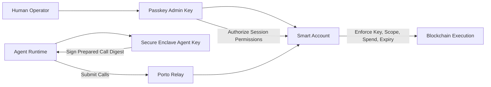

# openawa

openawa is a security-first wallet CLI for autonomous agents.

Tagline: "Your agent's wallet. Your hardware. Your keys."

It gives an agent a hardware-backed signing key plus onchain policy boundaries:

- Keys are created on your device and are non-extractable by default.
- A human admin grants constrained permissions for what the agent can do.
- The smart account enforces those constraints on every execution.

openawa is powered by [Porto](https://porto.sh) for account and relay workflows, while key custody stays local.

Core value:

- Local key custody instead of cloud-held agent keys.
- Onchain enforcement of spend limits, call scope, and expiry.
- Open-source backend infrastructure instead of a closed hosted black box.

## Alpha Status

This project is in alpha.

Current scope:

- Local-admin setup mode only (configure + passkey ceremony on the same machine).
- Command surface is stable around `configure`, `sign`, and `status`.
- macOS Secure Enclave path is the most exercised path today.

## Why openawa

Compared with cloud-key agent wallet products like [Coinbase Agentic Wallet](https://docs.cdp.coinbase.com/agentic-wallet/welcome), [Privy](https://www.privy.io/), [Turnkey](https://www.turnkey.com/), and [Sponge](https://paysponge.com/docs), openawa focuses on:

- Hardware-bound key custody: private signing key stays on your machine.
- Policy-bound autonomy: bounded permissions instead of unconstrained private key use.
- Open, inspectable CLI workflow: explicit setup, explicit grants, explicit status.

This is a different trust model than hosted-key or hosted-TEE stacks: openawa keeps the signing primitive on operator-owned hardware and uses onchain permissions for runtime boundaries.

## Quick Start

Install from npm:

```bash
npm install -g @openawa/cli
openawa --help
```

Or run from source:

```bash
# Node.js 22+
pnpm install
pnpm check
pnpm build
```

Run commands with:

```bash
node dist/cli.js <command> [options]
```

Minimal flow:

```bash
# 1) Configure account + permissions
node dist/cli.js configure --chain base-sepolia

# 2) Inspect current state
node dist/cli.js status --chain base-sepolia

# 3) Submit a call bundle
# Replace the payload below with your own contract call.
node dist/cli.js sign \
  --chain base-sepolia \
  --calls '[{"to":"0xabc...","data":"0x...","value":"0x0"}]'
```

Three commands, three jobs:

1. `configure` initializes or reuses the local key, connects the account, and grants permissions.
2. `sign` signs and submits prepared calls using the configured chain context.
3. `status` shows account, signer health, activation state, permissions, and balances.

## Chain Selection

Chain resolution accepts numeric IDs or names (case-insensitive, spaces/hyphens ignored):

- `--chain 84532`
- `--chain base-sepolia`
- `--chain "Base Sepolia"`

Behavior:

- One configured chain: `sign` can omit `--chain`.
- Multiple configured chains: `sign` requires `--chain` and returns `AMBIGUOUS_CHAIN` otherwise.
- `status` shows all configured chains by default; `--chain` filters.

## Security Model

Trust boundaries:

- Smart account is the policy enforcement point.
- Human admin key (passkey/WebAuthn) controls grant authority.
- Agent key is P-256, hardware-backed, non-extractable.

Passkey-gated reconfiguration:

- Account creation/configuration and permission changes require interactive passkey approval in standard WebAuthn/passkey flows.
- The agent cannot silently reconfigure its own permissions without human approval.

Why this mitigates malicious signing:

- The agent can only execute calls that match the granted permission envelope.
- Allowed contract targets/selectors, spend limits, and expiry are enforced by the smart account onchain.
- If an agent signs an out-of-scope request, execution is rejected onchain.

What "non-extractable" means here:

- The private key is not returned to user space as raw key bytes.
- Under standard platform threat models, the private key is non-extractable (non-exportable) from Secure Enclave/TPM-backed storage, though a compromised host may still invoke signing while access is live.

Residual risks:

- Prompt/tool misuse can still request unintended calls.
- In local-admin MVP mode, host compromise can still attempt approval workflows.
- This protection assumes passkeys are securely stored by the platform or passkey manager in use.
- Stronger separation is planned via off-device admin approval on a different trusted device.



## Powered By Porto

openawa keeps Porto as an internal backend, but you still inherit Porto's capabilities:

- Multi-chain account operations across Porto-supported chains, including examples like Base, Arbitrum One, OP Mainnet, Ethereum, Polygon, Base Sepolia, and OP Sepolia.
- Fee-token-aware UX: configure and funding checks read supported fee tokens from relay capabilities, not just native token balances.
- Permission primitives used by openawa policy setup: call scope, spend limits, fee caps, and expiry.
- Relay execution plumbing for call submission and status, including relay bundle IDs and onchain transaction hashes.

Porto and relay model:

- [Porto](https://porto.sh) provides the account and permission primitives.
- [Porto SDK Docs](https://porto.sh/sdk) document the underlying model and APIs.
- [Relay](https://github.com/ithacaxyz/relay) is fully open source and acts as the relay/RPC layer for account operations and submission.
- The relay is not the key custodian for the local hardware-backed agent key and does not need raw private key material from the local signer.

Relay account lifecycle:

1. Onboarding uses Porto's ephemeral-PK approach during account connection and creation via `wallet_connect`.
2. The passkey admin key is the high-authority key for account management and permission changes.
3. The admin grants constrained permissions to the agent key.
4. The agent signs locally; relay submits; the smart account enforces policy onchain.

Background:

- [Why did Ithaca drop prep in favor of the ephemeral-PK approach?](https://porto.sh/sdk/faq#why-did-ithaca-drop-prep-in-favor-of-the-ephemeral-pk-approach)

## Local Key Management Stack

openawa uses the local [`chipkey`](https://github.com/jeanregisser/chipkey) CLI (npm package: [`@chipkey/cli`](https://www.npmjs.com/package/@chipkey/cli)) for hardware-backed key creation and signing.

## Agent Integrations (Incur)

openawa is built with [incur](https://github.com/wevm/incur), so agent discovery/integration is first-class:

```bash
node dist/cli.js skills add  # install skill files into agent context
node dist/cli.js mcp add     # register CLI as an MCP server
node dist/cli.js --llms      # emit machine-readable manifest
```

## Configuration

Config directory:

- macOS: `~/Library/Application Support/openawa`
- Linux: `${XDG_CONFIG_HOME:-~/.config}/openawa`
- Windows: `%APPDATA%/openawa`

Override root path with:

- `AGENT_WALLET_CONFIG_HOME`

Relay endpoint override:

- `AGENT_WALLET_RELAY_URL`

## Development

```bash
pnpm check
pnpm format
pnpm lint
pnpm build
pnpm test
pnpm test:e2e
```

`pnpm install` enables Husky hooks. Pre-commit runs lint-staged with staged-file `oxlint`/`oxfmt`.

## Shoutouts

Big shoutout to the teams and projects making this possible:

- [Porto](https://porto.sh) and [Relay](https://github.com/ithacaxyz/relay) from [Ithaca](https://github.com/ithacaxyz)
- [incur](https://github.com/wevm/incur), [viem](https://github.com/wevm/viem), and the folks at [wevm](https://wevm.dev/)

## Roadmap (Post-Alpha)

- Remote-admin setup mode (admin ceremony off-device for stronger host-compromise separation).
- Account profile ergonomics (alias + default selection).
- Additional backend adapters only where security/operability improves.
