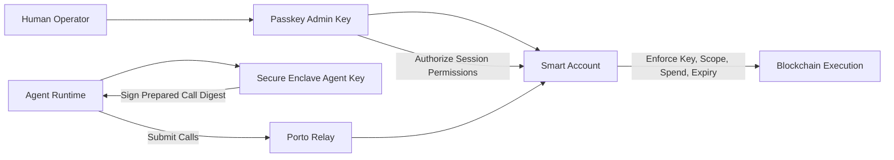

# CLI Spec (v0.3)

## Product Direction

`openawa` is a security-first wallet CLI for autonomous agents.

Primary user promise:

- Give an agent a wallet that can act autonomously with tight, inspectable policy boundaries.
- Keep private key operations hardware-backed and non-extractable by default.
- Minimize footguns in non-interactive/automation contexts.

Porto is currently the execution backend, but not the user-facing mental model.

## Design Principles

- Security-first defaults: deny by default, grant least privilege.
- Non-exportable signing keys: private key material never returned to user-space.
- Policy-bound autonomy: expiry, spend constraints, and call allowlists.
- Operational clarity: predictable JSON outputs and actionable errors.
- Explicit interactivity: interactive steps fail clearly in headless environments.

## Scope & Constraints (MVP)

- Language/runtime: TypeScript on Node.js ESM.
- Signer backend: real macOS Secure Enclave now; backend interface for future platforms.
- Config path: platform-standard user config directory with `AGENT_WALLET_CONFIG_HOME` override.
- Backend today: Porto.
- Setup mode for MVP: local-admin only (same device runs configure and passkey ceremony).
- Security follow-up: move signer opaque handle from config into OS keychain storage.

## Security Model (Porto-Derived)

Core entities:

- Smart account onchain (policy enforcement point).
- Human admin key (passkey/WebAuthn) with full administrative authority.
- Agent key (P-256, Secure Enclave-backed, non-extractable) used for autonomous operations.

Trust and enforcement:

- Human admin authorizes agent key permissions on the smart account.
- Local passkey authorization requires user interaction (presence/verification), so the agent cannot silently self-authorize.
- Agent key can sign, but only within granted policy boundaries.
- Smart account enforces policy on every call (scope, spend, expiry, and key binding).
- Agent private key cannot be exported from Secure Enclave by design.

Primary residual risk:

- Prompt/tool misuse can cause unintended calls to be requested.
- Mitigation is least-privilege permissions, short expiries, and revocation/rotation.
- Local-admin note (MVP): if the admin passkey is used on the same host as the agent runtime, host compromise can still drive approval attempts.



## Canonical UX (Target)

Three user-facing commands:

### 1. `openawa configure`

Configures one account end-to-end for a single chain per run:

- create or reuse account
- initialize/reuse local agent signing key
- grant permissions using Porto inline grant via `wallet_connect`
- report granted permission ID

Expected characteristics:

- idempotent when re-run (skips grant if an active permission already exists)
- interactive by default (opens Porto dialog for passkey/account selection)
- explicit human progress output with step context
- per-step operator guidance (`Now`, `You`, result, and next action on failure)
- funding detection checks all Porto-supported fee tokens for the selected chain (not only native balance)
- funding detection reads fee-token support from Porto capabilities and surfaces capability/balance lookup errors directly (no silent fallback path)

#### Chain selection (`--chain`)

- `--chain <name|id>`: selects the chain for this configure run (required in non-interactive mode).
  - Accepted forms: numeric chain ID (`8453`), viem chain name — case-insensitive, spaces/hyphens ignored:
    - `base-sepolia`, `Base Sepolia`, `basesepolia` → Base Sepolia (chainId 84532)
    - `op-mainnet`, `OP Mainnet`, `opmainnet` → OP Mainnet (chainId 10)
    - `arbitrum-one`, `Arbitrum One` → Arbitrum One (chainId 42161)
  - Interactive fallback (TTY, no `--chain`): shows a chain picker (single-select) listing all Porto-supported chains, grouped mainnets first then testnets, default highlighted: Base Sepolia.
  - Non-interactive + no `--chain` → `NON_INTERACTIVE_REQUIRES_FLAGS` error.
- One chain per configure run. Running again for a different chain adds it to the config.
- Config stores `chainIds[]` accumulating across runs.

MVP policy:

- `configure` supports local-admin setup only.
- `configure` is add-only: to revoke permissions, use id.porto.sh.
- Remote-admin/out-of-band setup (admin ceremony on another device) is explicitly deferred.
- Permission policy (call allowlist, spend limits, expiry) is configurable via flags or interactive prompts.

Default permission envelope:

- Calls: any target, any function selector
- Spend: user-specified (required flag in non-interactive)
- Expiry: user-specified (required flag in non-interactive)

Fee cap defaults per chain:

- Base Sepolia: 25 EXP/period (EXP is a non-native fee token on Base Sepolia)
- All other chains: 0.01 native currency/period

Idempotency semantics:

- `configure` must never create duplicate signer keys or duplicate permission grants.
- Re-running `configure` checks for an existing active permission via `wallet_getKeys` before granting.
- If an active permission exists, the account step reports `already_ok` and skips the dialog.
- If no active permission exists, `configure` opens the dialog for sign-in + grant.

Checkpoint identifiers in output:

- `agent_key`
- `account`

Each step prints:

- step position
- what is happening now
- what the human must do (or that no action is required)
- success/failure for that step
- actionable next step if failed

Active permissions are resolved from Relay key state (`wallet_getKeys`).
Locally persisted `permissionIds` are a cache only.

### 2. `openawa sign`

Agent execution/signing command.

For MVP this is call-bundle oriented:

- prepare calls
- sign digest using local hardware-backed key
- submit prepared calls
- return both relay bundle id and send status
- avoid ambiguity between relay and chain identifiers: `bundleId` is relay-only, `txHash` is onchain-only

#### Chain selection (`--chain`)

- `--chain <name|id>`: selects which configured chain to use (same resolution as `configure`).
- Single chain configured, no flag → use it (no behavior change).
- Multiple chains, no flag → `AMBIGUOUS_CHAIN` error listing configured chains with `--chain` hints.

Advanced/raw signing is out of scope for MVP.

### 3. `openawa status`

Inspection command.

Should include:

- active account address
- backend/provider in use
- activation state (`active_onchain`, `precall_pending`, or `unconfigured`)
- key backend health
- per-chain permissions summary + balance (for all configured chains)
- optional `--chain <name|id>` to filter to a single chain

MVP status behavior:

- `status` permission summary is derived from Relay key state and does not initiate a dialog connect.
- If no active agent permission is found on Relay, permissions summary reports zero and activation state is `unconfigured`.
- Without `--chain`, all configured chains are shown.

## Chain Model

- One chain per `configure` run; config stores `chainIds: number[]` accumulating across runs.
- First configured chain is the primary; order is maintained.
- `sign` requires exactly one chain: auto-resolved when only one is configured, explicit `--chain` when multiple.
- `status` shows all configured chains by default; `--chain` filters to one.
- Porto uses a single relay (`rpc.porto.sh`) that serves all supported chains — no separate relay configuration needed.

Supported chains (sourced from `porto.Chains.all`):

- Mainnets: Base (8453), Arbitrum One (42161), Berachain (80094), BNB Smart Chain (56), Celo (42220), Ethereum (1), OP Mainnet (10), Polygon (137), Gnosis (100), Katana (747474)
- Testnets: Base Sepolia (84532), Arbitrum Sepolia (421614), Berachain Bepolia (80069), Hoodi (560048), OP Sepolia (11155420), Sepolia (11155111)

## Account Model

- Multiple accounts are first-class in the data model.
- Selection key: `--account <address-or-alias>`.
- Alias support should be supported in config and surfaced in `status`.
- If no account is passed, use configured default account.

## Internal Architecture

- Keep provider details behind an adapter boundary.
- Current adapter: Porto.
- Keep "Powered by Porto" visible in docs/version/status output.
- Avoid premature multi-provider abstraction complexity until a second backend is real.

## Custody Stance

- Key custody is user-controlled and non-custodial.
- Provider infrastructure (currently Porto) is an execution dependency, not a key custodian.
- Project goal is low provider lock-in through adapter boundaries, without claiming infrastructure independence.

## Output Contract

Global output modes:

- `--json`: machine-readable output (stable schema).
- `--human`: operator-friendly output (tables/messages).

Command defaults (MVP):

- `configure`: human-only interactive flow (progress text is the contract).
- `sign`: json-first, with optional concise human summary.
- `status`: human-first by default, with full `--json` parity.

Implementation rules:

- Commands must use a single business-logic path and separate renderers.
- JSON mode writes only JSON to stdout.
- Human logs/progress/spinners must not be mixed into JSON stdout.
- Errors must preserve structured codes/details in JSON mode.
- `configure` is an exception: it is human-output only and should reject `--json`.

## Error Model

All command failures return:

```json
{ "ok": false, "error": { "code": "...", "message": "...", "details": {} } }
```

Notable error codes:

- `MISSING_CHAIN_ID`: no chain configured; run `configure --chain <name>` first.
- `AMBIGUOUS_CHAIN`: multiple chains configured but no `--chain` flag given.
- `INVALID_CHAIN`: unknown chain name or ID provided.
- `CHAIN_NOT_CONFIGURED`: specified chain exists but hasn't been configured yet.

## Testing (E2E)

Strategy:

- Prefer a small number of scenario tests with broad coverage over many narrow tests.
- Each feature test should validate behavior plus the key invariants that prevent regression slope.
- Every top-level feature must have at least one robust e2e scenario.

Required scenario set (concise but high-signal):

1. `configure.e2e`

- Happy path: creates or reuses account and grants agent key permissions.
- Recovery invariant: rerun is idempotent and does not duplicate keys/grants.
- Output invariant: human flow markers appear in order (step/now/result), include actionable guidance.

2. `sign.e2e`

- Happy path: call succeeds with a valid bundle ID.
- Output invariant: JSON response schema is stable.

3. `status.e2e`

- Happy path: reports account, per-chain permissions summary, and balances.
- Output invariant: both `--json` and `--human` modes work.

4. Multi-chain invariant:

- After configuring two chains, `sign` without `--chain` fails with `AMBIGUOUS_CHAIN`.
- `sign --chain <name>` works for each configured chain.
- `status` shows both chains.

Notes:

- E2E defaults to testnet (Base Sepolia + faucet funding) for automation reliability, with optional prod override for manual smoke checks.
- E2E files live under `test/e2e` and use the `*.e2e.ts` naming convention.
- E2E tests run as the dedicated `e2e` Vitest project.
- E2E scenarios run in live mode only.
- `configure` happy-path e2e must automate the full browser passkey ceremony.
- Browser passkey automation uses Playwright virtual authenticators (`WebAuthn.addVirtualAuthenticator`) so registration + assertion are exercised in tests.
- Current test defaults:
  - `AGENT_WALLET_E2E_NETWORK=testnet` (default when unset)
  - optional `AGENT_WALLET_E2E_NETWORK=prod` override
  - optional `AGENT_WALLET_E2E_DIALOG_HOST=<host>` override
  - optional `AGENT_WALLET_E2E_HEADLESS=0` to run browser visibly for manual debugging
  - optional `AGENT_WALLET_E2E_STRICT_DIALOG=0` to tolerate non-actionable follow-up dialog URLs (debug-only)

## Current Implementation Note

Current codebase now exposes the top-level command surface:

- `openawa configure`
- `openawa sign`
- `openawa status`

Porto remains an internal adapter and is not exposed as a dedicated CLI command group.

## Next Iteration Checklist

- [x] Replace user-facing `porto` command group with `configure`, `sign`, `status`.
- [ ] Introduce account profile model with alias + default selection.
- [x] Keep Porto adapter internal and non-primary in CLI docs/help.
- [x] Implement global `--json` / `--human` output modes with per-command defaults.
- [ ] Move Secure Enclave opaque handle storage from config to keychain item.
- [x] Add E2E coverage for new top-level command surface.
- [ ] Add remote-admin setup mode (out-of-band admin ceremony from separate device).
- [ ] Evaluate additional backend adapters (e.g., ZeroDev, Privy, Para, others) using security/custody/lock-in criteria before adding support.
- [x] Proper multichain support: `--chain` flag, `chainIds[]` config, per-chain status.
